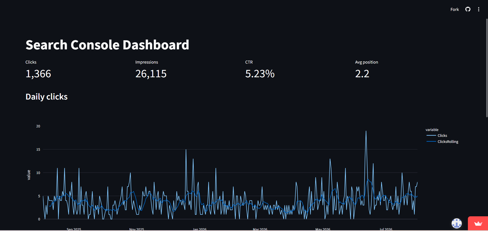

# Search Console Dashboard

An interactive dashboard that turns Google Search Console CSV exports into a browsable view of a website's organic search performance.

## The problem it solves

Google Search Console shows solid data, but its interface makes long-term analysis awkward: exports arrive as a bundle of separate CSV files with locale-specific headers, CTR stored as percentage strings, and no derived metrics. Comparing months, spotting trends, or handing a clean report to a client all mean manual spreadsheet work. This project automates that step — it ingests the raw export and produces a dashboard anyone can read without touching the data.

It is aimed at anyone maintaining a website's SEO who wants a faster read on their Search Console data than the native interface provides.

## Features

- KPI cards for clicks, impressions, CTR and average position
- Daily clicks chart with a 7-day rolling average to smooth weekday noise
- Monthly aggregation with month-over-month change
- Slovak-to-English header normalisation, so exports work regardless of the Search Console interface language
- CTR parsed from percentage strings into numeric values
- Error handling for missing files and malformed input

## Installation

```bash
git clone https://github.com/chlebaka/data-pipeline-dashboard.git
cd data-pipeline-dashboard
uv sync
```

Requires Python 3.13 and [uv](https://docs.astral.sh/uv/).

## Usage

Run the dashboard:

```bash
uv run streamlit run src/app.py
```

Then open http://localhost:8501.

Run the pipeline modules directly to inspect their output:

```bash
uv run python src/ingest.py
uv run python src/transform.py
```

Example output from `src/ingest.py`:

```
        Date  Clicks  Impressions     CTR  Position
0 2025-08-02       5           84  0.0595       2.2
1 2025-08-03       2           43  0.0465       3.0
2 2025-08-04       0           35  0.0000       2.2

Rows: 365
```

Run the tests:

```bash
uv run pytest
uv run ruff check .
```

## How it works

The pipeline is three layers, each a set of pure functions that take a DataFrame and return a DataFrame:

```
data/*.csv  →  ingest.py  →  transform.py  →  app.py
                  │              │              │
              load, rename,  aggregate,     KPI cards,
              parse CTR      rolling avg,   charts,
                             MoM change     tables
```

`ingest.py` reads the CSV exports, translates Slovak headers to English column names, and converts CTR from strings like `5.95%` into floats. `transform.py` derives the metrics Search Console does not provide: monthly totals, a rolling average, and month-over-month change. Note that monthly CTR is recalculated from total clicks and impressions rather than averaged — averaging daily CTR would let a day with three impressions weigh the same as a day with three hundred. `app.py` composes these into the Streamlit view.

## Tech stack

- **Python 3.13** with **uv** for dependency management
- **pandas** for data processing
- **Streamlit** for the dashboard, **Plotly** for charts
- **pytest** for tests, **ruff** for linting
- **GitHub Actions** running both on every push

## Data

Sample data in `data/` is a real Google Search Console export from [taxipalus.com](https://taxipalus.com), covering twelve months with roughly 1,400 clicks and 26,000 impressions. It is not synthetic. The export contains only aggregated search metrics — no personal or identifying data.

To use your own data, export from Search Console (Performance → Export → CSV), unzip into `data/`, and the pipeline will pick it up.

## Live demo

https://data-pipeline-dashboard-mfhncyqezq52hbppymwrt3.streamlit.app

## Screenshot

